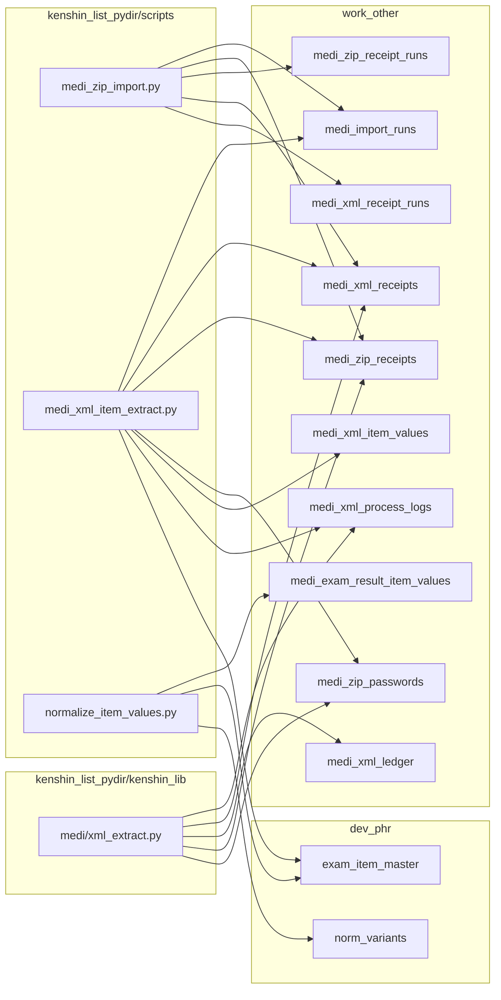

# ADR 0004: kenshin_list_pydir Script Actions & Wiring Map（v1.0 as-is）

## 1. Status

Accepted（as-is snapshot / later reconcile）

## 2. Context

PHR v1.0 は freeze 済み。work_folder 側（Hub/Fund）は ADR 0003 で as-is 契約を固定した。  
本ADR 0004 は `kenshin_list_pydir` 側の **取込〜抽出（ZIP→XML→ITEM）** について、  
スクリプト/モジュールの docstring を一次情報（Fact）として「現状の意味」を固定する。

（重要）本ADRは **推測で補完しない**。対象外の工程（正規化/LSIO判定/XML出力等）は別ADRで追記する。

## 3. Scope

### In-scope（本ADRの対象）

- `scripts/kenshin_list_pydir/scripts/medi_zip_import.py`
- `scripts/kenshin_list_pydir/kenshin_lib/medi/xml_extract.py`
- `scripts/kenshin_list_pydir/scripts/medi_xml_item_extract.py`
- `scripts/kenshin_list_pydir/scripts/normalize_item_values.py`

### Out-of-scope（対象外。後で追記）

- `normalize_db_update.py` 等のDB反映工程
- `medi_export_xml.py` 等の出力工程
- shared_files 系（scan/copy/judge 等）

## 4. Script Actions（Fact）

### 4.1 medi_zip_import.py（ZIP受付・棚卸し）

- Writes (work_other)
  - `medi_import_runs`
  - `medi_zip_receipts`
  - `medi_zip_receipt_runs`
  - `medi_xml_receipts`
  - `medi_xml_receipt_runs`
- Writes (dev_phr)
  - なし

固定仕様（v1.0）:
- ZIP構造判定: DATA有無ではなく **XML検出優先**
- XML棚卸し: `status='PENDING'` 運用
- commit境界: run開始 / ZIP単位 upsert完了 / XML棚卸し完了

### 4.2 xml_extract.py（XML抽出フェーズ本体）

- 本モジュールは runner ではなくロジック本体（cursorを受けてSQLを実行）。  
  commit/rollback 境界は呼び出し元（runner script）側が管理する。

- Writes (work_other)
  - `medi_xml_process_logs`
  - `medi_xml_receipts`
  - `medi_xml_ledger`
- Reads (work_other)
  - `medi_xml_receipts`
  - `medi_zip_receipts`
  - `medi_zip_passwords`
- Reads/Writes (dev_phr)
  - なし

固定方針（POLICY 2026-01-20）:
- 欠損は warning としてログへ残し、ledger には NULL のまま格納して継続する

### 4.3 medi_xml_item_extract.py（ITEM抽出 runner）

- Reads (work_other)
  - `medi_xml_receipts`（status='OK'）
  - `medi_zip_receipts`
  - `medi_zip_passwords`（enabled時）
  - `medi_import_runs`（ENV run_id 存在確認）
- Writes (work_other)
  - `medi_import_runs`（run 起票/finish）
  - `medi_xml_item_values`（UPSERT）
  - `medi_xml_receipts`（items_extract_*）
  - `medi_xml_process_logs`（step='EXTRACT_ITEMS'）
- Reads (dev_phr)
  - `exam_item_master`（xml_value_type/value_method のヒント）
- Writes (dev_phr)
  - なし

commit境界（as-is）:
- run 起票直後に commit
- 50件ごとに commit
- ループ後 commit → finish_run → commit

終了コード（as-is）:
- 0: err=0 かつ zero_hit=0
- 2: err>0 または zero_hit>0

### 4.4 normalize_item_values.py（最小正規化フェーズ）

- Reads (work_other)
  - `medi_exam_result_item_values`（normalize_status='RAW' かつ value NULL/''）
- Writes (work_other)
  - `medi_exam_result_item_values`（value / normalize_status / normalized_at / normalize_error を UPDATE）
- Reads (dev_phr)
  - `exam_item_master`（xml_value_type / result_code_oid）
  - `norm_variants`（result_code_oid + raw_value_utf8 の完全一致 → normalized_code）
- Writes (dev_phr)
  - なし

固定方針（v1.0）:
- 「推測補完しない」を正規化ポリシーとする。
- RAWのみを対象とし、OK/ERROR に明示的に分類する。
- ループ中は commit せず、最後に 1回だけ commit する。

## 5. Wiring Map（Script → Table）



## 6. Phase Flow（ZIP→XML→ITEM）

```mermaid
flowchart TD
  A[ZIP受付/棚卸し\nmedi_zip_import] --> B[XML抽出\n(xml_extract: receipts OK / ledger upsert)]
  B --> C[ITEM生抽出\nmedi_xml_item_extract]
  C --> D[最小正規化\nnormalize_item_values]

  subgraph status[主要status]
    S1[medi_xml_receipts.status: PENDING -> OK/ERROR]
    S2[medi_xml_receipts.items_extract_status: (OK対象) -> OK/ERROR/SKIP]
    S3[medi_exam_result_item_values.normalize_status: RAW -> OK/ERROR]
  end

  A --> S1
  C --> S2
  D --> S3
```

## 7. Notes（Reconcile Later）

- 本ADRは「スクリプトdocstring/実装」を一次情報として固定する。
- DDL再整理（FK/NOT NULL/型/長さ）との突合は後フェーズで行い、差分が出た場合は **事実に基づき**本ADRと docstring を修正する。

## 8. Decision

- `kenshin_list_pydir` の ZIP→XML→ITEM について、上記3ファイルの as-is 契約を v1.0 の固定一次情報として採用する。
- 正規化/LSIO判定/出力/共有ファイル系は別ADRで後日追記する。
