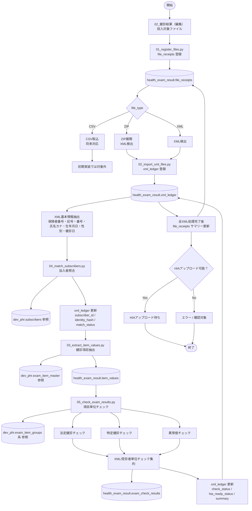

# health_exam_result v2 初期処理フロー

このドキュメントは、`health_exam_result v2` の初期実装におけるローカルシステム処理フローを整理する。

未着管理、医療機関回答待ち、再提出管理、HIAアップロード後の業務管理は初期実装フローから分離し、別途業務フローとして整理する。

---

## 初期実装スコープ

初期実装では、以下を成立させることを目的とする。

- 受領・編集済みファイルを `file_receipts` に登録する。
- ファイルからXMLを検出し、`xml_ledger` に登録する。
- XML基本情報から `subscribers.id` を解決する。
- XMLに実際に存在した健診値を `item_values` に登録する。
- 法定健診・特定健診・異常値チェックを行い、`exam_check_results` に登録する。
- `xml_ledger` と `file_receipts` に処理結果を集約する。
- HIAアップロード待ち、またはエラーとして状態を整理する。

---

## Mermaid フロー

---

## フローとスクリプトの対応

| 処理 | 主担当スクリプト | 主な更新テーブル | 主な参照テーブル |
| --- | --- | --- | --- |
| ファイル検出・登録 | `01_register_files.py` | `health_exam_result.file_receipts` | なし |
| ZIP展開・XML検出・XML台帳登録 | `02_import_xml_files.py` | `health_exam_result.xml_ledger`, `health_exam_result.file_receipts` | なし |
| 健診項目抽出 | `03_extract_item_values.py` | `health_exam_result.item_values`, `health_exam_result.xml_ledger` | `dev_phr.exam_item_master` |
| 加入者照合 | `04_match_subscribers.py` | `health_exam_result.xml_ledger` | `dev_phr.subscribers` |
| 法定・特定・異常値チェック | `05_check_exam_results.py` | `health_exam_result.exam_check_results`, `health_exam_result.xml_ledger` | `dev_phr.exam_item_master`, `dev_phr.exam_item_groups` 系 |
| HIAアップロード待ち整理 | `05_check_exam_results.py` または後続スクリプト | `health_exam_result.xml_ledger`, `health_exam_result.file_receipts` | `health_exam_result.exam_check_results` |

---

## 初期実装では分離する業務フロー

以下は初期処理フローには含めず、別フローとして整理する。

- 医療機関回答待ち
- 再提出受領
- 前回提出との差分比較
- 結果未着チェック
- HIAアップロード実行後の結果反映
- 受領台帳へのサマリー書き戻し運用

---

## 現時点の考え

初期実装では、`file_receipts`、`xml_ledger`、`item_values`、`exam_check_results` を中心に、XML/受診者単位で一気通貫に処理する。

ファイル単位のサマリーは、個別XML処理完了後に `file_receipts` へ集約する。

`zip_receipts` は独立テーブルとしては作成せず、ZIPは `file_receipts.file_type` による処理分岐として扱う。