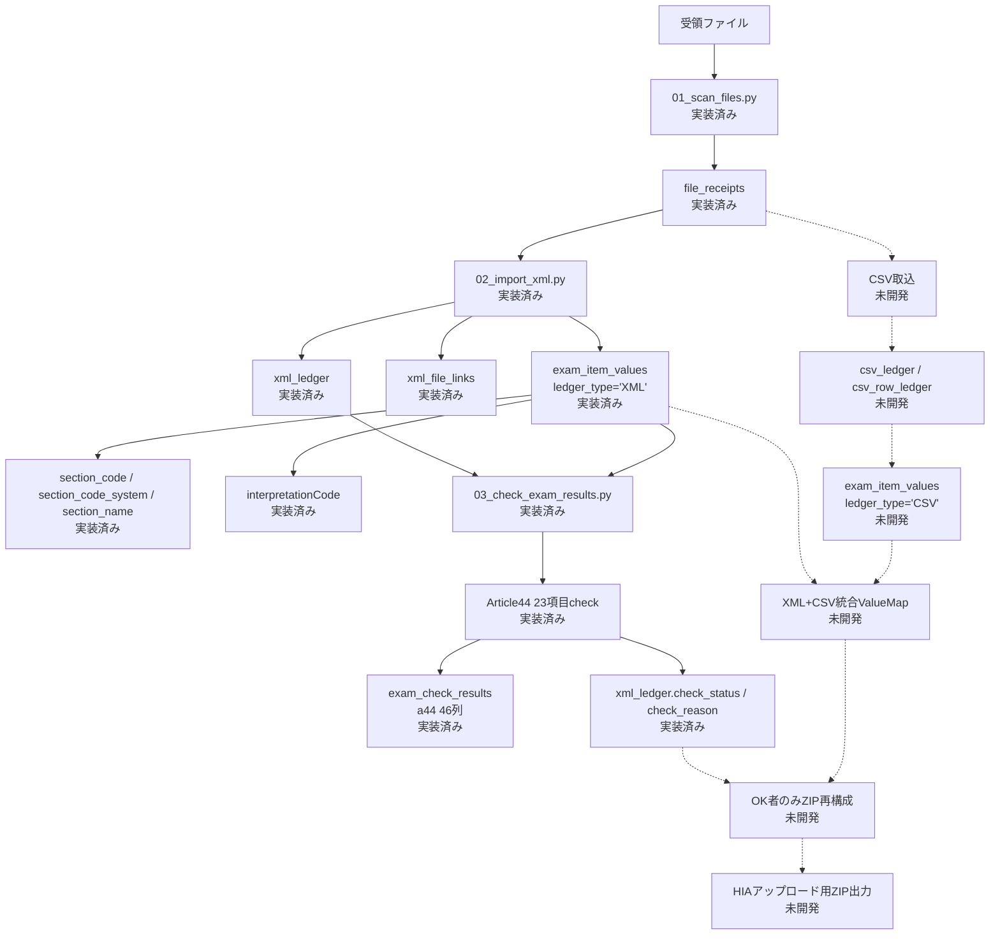

# health_exam_result v2 システム処理フロー

このドキュメントは、`health_exam_result v2` のシステム処理フローを整理する。

業務上の状態確認、予約CSVとの突合、HIAダッシュボード突合、アップロード判断は `13_operation_flow.md` で扱う。本ドキュメントでは、受領ファイルをローカルDBへ取り込み、健診値とチェック結果を保存するところまでを対象とする。

---

## 現在の実装スコープ

現時点で実装済みの中心処理は以下。

- 設定YAMLの `event_id` から `event.result_root_path` を取得する。
- `medical_folder_aliases` を参照し、イベント配下の医療機関フォルダを探索する。
- 受領・編集済みファイルをフルスキャンし、未登録ファイルのみ `file_receipts` に登録する。
- ZIPまたはXMLファイルからXMLを検出する。
- XML内容は `xml_sha256` で一意判定し、`xml_ledger` に登録する。
- 物理ファイルとXML内容の対応を `xml_file_links` に登録する。
- XML基本情報から `subscribers.id` を解決する。
- XMLに実際に存在した健診値を `exam_item_values` に登録する。
- `exam_item_values` には親CDA section情報を保存する。
- `exam_item_values` にはXML上の `interpretationCode` を保存する。
- Article44 23項目の法定健診チェックを行い、`exam_check_results` の `a44_*_status/reason` へ保存する。
- 法定チェック結果を `xml_ledger.check_status / check_reason` へ反映する。

現時点で未開発・後続フェーズのものは以下。

- CSV取込。
- `csv_ledger` または `csv_row_ledger`。
- CSV由来値の `exam_item_values` 合流。
- XML+CSV統合ValueMap。
- OK者のみのZIP再構成。
- HIAアップロード用ZIP出力。
- `04_export_hia_xml.py`。
- HIAダッシュボード突合。
- 予約CSV突合。

---

## システム処理フロー



---

## フローとスクリプトの対応

| 処理 | 主担当スクリプト | 主な更新テーブル | 状態 |
| --- | --- | --- | --- |
| イベント・医療機関フォルダ探索 | `01_scan_files.py` | なし | 実装済み |
| ファイル検出・登録 | `01_scan_files.py` | `file_receipts`, `etl_runs`, `etl_errors` | 実装済み |
| work一時コピー | `02_import_xml.py` | なし | 実装済み |
| ZIP展開・XML検出 | `02_import_xml.py` | `file_receipts` | 実装済み |
| XML内容台帳登録 | `02_import_xml.py` | `xml_ledger`, `xml_file_links` | 実装済み |
| XML基本情報抽出・加入者照合 | `02_import_xml.py` | `xml_ledger` | 実装済み |
| 健診項目抽出 | `02_import_xml.py` | `exam_item_values` | 実装済み |
| section情報保存 | `02_import_xml.py` | `exam_item_values.section_*` | 実装済み |
| interpretationCode保存 | `02_import_xml.py` | `exam_item_values.interpretation_*` | 実装済み |
| Article44法定健診チェック | `03_check_exam_results.py` | `exam_check_results`, `xml_ledger` | 実装済み |
| CSV取込 | 未定 | `csv_ledger`, `exam_item_values` | 未開発 |
| XML+CSV統合チェック | 未定 | `exam_check_results` または将来台帳 | 未開発 |
| OK者ZIP再構成 | 未定 | 出力ファイル | 未開発 |
| HIAアップロード用ZIP出力 | `04_export_hia_xml.py` 候補 | 出力ファイル | 未開発 |

---

## 現行DB上の責務

| テーブル | 役割 |
| --- | --- |
| `file_receipts` | 物理ファイル受領台帳 |
| `xml_ledger` | XML内容単位の台帳 |
| `xml_file_links` | 物理ファイルとXML内容の対応 |
| `exam_item_values` | XMLまたは将来CSVから抽出した健診値の共通保存先 |
| `exam_check_results` | Article44 23項目チェック結果 |

`exam_item_values` は、将来的に `ledger_type='CSV'` の値も受け入れる共通テーブルとして扱う。現時点ではXML由来のみが実装済み。

---

## CSV合流の将来構想

CSVは `exam_item_values` へ合流させる方針とする。

想定は以下。

```text
csv_ledger または csv_row_ledger
    ↓
exam_item_values
    ledger_type = 'CSV'
    ledger_id = csv_ledger.id
```

XML由来値は現行どおり以下。

```text
xml_ledger
    ↓
exam_item_values
    ledger_type = 'XML'
    ledger_id = xml_ledger.id
```

CSVを合流させた後は、以下の成立経路を判定できるようにする。

- XMLのみでOK。
- CSVのみでOK。
- XML+CSV統合でOK。
- XML+CSVを合わせてもNG。

CSVのみOK、または統合OKの場合は、HIAアップロードに必要なXMLを生成する。ただしこれは値を改変する処理ではなく、受け取った値を正式なXML形式へ整形する処理として扱う。

---

## 本ドキュメントで扱わないこと

以下は `13_operation_flow.md` で扱う。

- 健診データ状態突合。
- HIAダッシュボード状態突合。
- 予約状態突合。
- アップロード可否判断。
- 医療機関確認。
- 再提出管理。
- 結果未着管理。
- アップロード後の業務状態管理。

---

## 現時点の考え

v2のシステム処理は、まずXML由来の健診値を確実に保存し、Article44 23項目チェックを安定させる段階まで到達している。

次の大きな拡張は、CSV由来値を `exam_item_values` に合流させることと、XML/CSVを人単位の健診データ状態突合へ接続することである。

人単位・イベント単位の状態管理は、`xml_ledger` だけでは表現しきれない。将来的には、`event_id` と `subscriber_id` を中心にした統合健診台帳を追加し、その配下にXML・CSVの入力台帳をぶら下げる構造を検討する。
