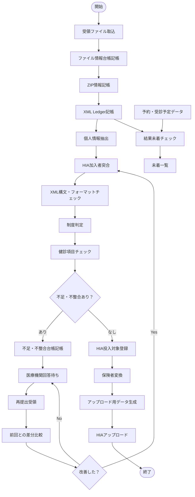

# ローカルシステム（受領）処理フロー

```mermaid
flowchart TD

%% ===== 受領 =====
A([開始])

A --> B[受領ファイル取込]
B --> C[ファイル情報台帳記帳]
C --> D[ZIP情報記帳]
D --> E[XML Ledger記帳]

%% ===== XML =====

E --> F[個人情報抽出]

F --> G[HIA加入者突合]

%% ===== チェック =====

G --> H[XML構文・フォーマットチェック]

H --> I[制度判定]
I --> J[健診項目チェック]

J --> K{不足・不整合あり？}

%% ===== NG =====

K -->|あり| L[不足・不整合台帳記帳]

L --> M[医療機関回答待ち]

M --> N[再提出受領]

N --> O[前回との差分比較]

O --> P{改善した？}

P -->|Yes| G

P -->|No| M

%% ===== OK =====

K -->|なし| Q[HIA投入対象登録]

Q --> R[保険者変換]

R --> S[アップロード用データ生成]

S --> T[HIAアップロード]

%% ===== 未着 =====

U[予約・受診予定データ]
U --> V[結果未着チェック]

V --> W[未着一覧]

E --> V

%% ===== END =====

T --> X([終了])
```