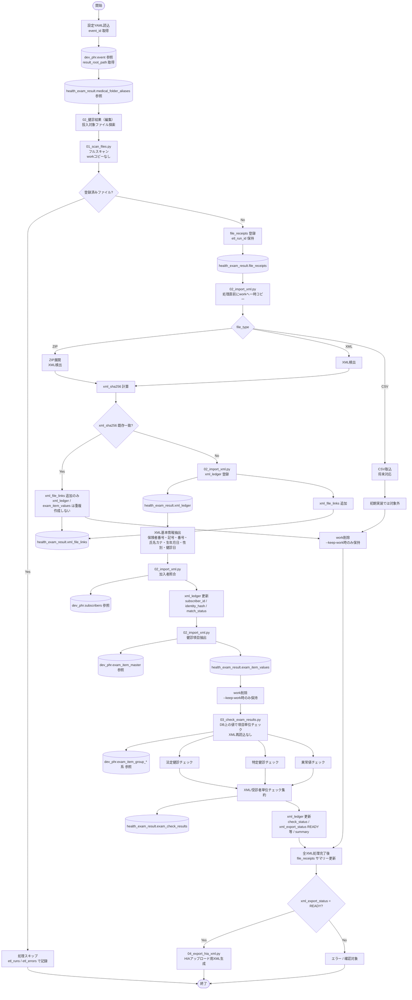

# health_exam_result v2 初期処理フロー

このドキュメントは、`health_exam_result v2` の初期実装におけるローカルシステム処理フローを整理する。

未着管理、医療機関回答待ち、再提出管理、HIAアップロード後の業務管理は初期実装フローから分離し、別途業務フローとして整理する。

---

## 初期実装スコープ

初期実装では、以下を成立させることを目的とする。

- 設定YAMLの `event_id` から `event.result_root_path` を取得する。
- `medical_folder_aliases` を参照し、イベント配下の医療機関フォルダを探索する。
- 受領・編集済みファイルを毎回フルスキャンし、未登録ファイルのみ `file_receipts` に登録する。
- `01_scan_files.py` では `work` へのコピーを行わない。
- 登録済みファイルは処理対象外としてスキップし、ETL実行ログ側でスキップ件数・理由を確認できるようにする。
- ZIPまたはXMLファイルからXMLを検出する。
- XML内容は `xml_sha256` で一意判定し、`xml_ledger` に登録する。
- 物理ファイルとXML内容の対応を `xml_file_links` に登録する。
- 同一 `xml_sha256` のXMLを別ZIP等で再受領した場合は、`xml_ledger` を新規作成せず、`xml_file_links` のみ追加する。
- XML基本情報から `subscribers.id` を解決する。
- XMLに実際に存在した健診値を `exam_item_values` に登録する。
- 法定健診・特定健診・異常値チェックを行い、`exam_check_results` に登録する。
- `xml_ledger` と `file_receipts` に処理結果を集約する。
- `xml_export_status` により、HIAアップロード用XMLの出力状態を整理する。

---

## Mermaid フロー

---

## フローとスクリプトの対応

| 処理 | 主担当スクリプト | 主な更新テーブル | 主な参照テーブル |
| --- | --- | --- | --- |
| イベント・医療機関フォルダ探索 | `01_scan_files.py` | なし | `dev_phr.event`, `health_exam_result.medical_folder_aliases` |
| ファイル検出・登録 | `01_scan_files.py` | `health_exam_result.file_receipts`, `etl_runs` / `etl_errors` | `health_exam_result.file_receipts` |
| work一時コピー | `02_import_xml.py` | なし | `health_exam_result.file_receipts` |
| ZIP展開・XML検出 | `02_import_xml.py` | `health_exam_result.file_receipts` | `health_exam_result.file_receipts` |
| XML内容台帳登録 | `02_import_xml.py` | `health_exam_result.xml_ledger`, `health_exam_result.xml_file_links` | `health_exam_result.file_receipts`, `health_exam_result.xml_ledger` |
| XML基本情報抽出・加入者照合 | `02_import_xml.py` | `health_exam_result.xml_ledger` | `dev_phr.subscribers` |
| 健診項目抽出 | `02_import_xml.py` | `health_exam_result.exam_item_values`, `health_exam_result.xml_ledger` | `dev_phr.exam_item_master` |
| 法定・特定・異常値チェック | `03_check_exam_results.py` | `health_exam_result.exam_check_results`, `health_exam_result.xml_ledger` | `health_exam_result.exam_item_values`, `dev_phr.exam_item_group_*` 系 |
| XML出力状態整理 | `03_check_exam_results.py` | `health_exam_result.xml_ledger` | `health_exam_result.exam_check_results` |
| HIAアップロード用XML生成 | `04_export_hia_xml.py` | 出力ファイル、`health_exam_result.xml_ledger` | `health_exam_result.xml_ledger`, `health_exam_result.exam_item_values`, `health_exam_result.exam_check_results` |

---

## 初期実装では分離する業務フロー

以下は初期処理フローには含めず、別フローとして整理する。

- 医療機関回答待ち
- 再提出受領
- 前回提出との差分比較
- 結果未着チェック
- HIAアップロード実行後の結果反映
- 受領台帳へのサマリー書き戻し運用

---

## 現時点の考え

初期実装では、`file_receipts`、`xml_file_links`、`xml_ledger`、`exam_item_values`、`exam_check_results` を中心に、XML内容単位で一気通貫に処理する。

`file_receipts` は物理ファイル受領台帳、`xml_ledger` はXML内容の一意台帳、`xml_file_links` は物理ファイルとXML内容の対応台帳とする。

登録済みファイルは処理対象外としてスキップする。同一ZIPは、共有フォルダ上で `02_健診結果（編集）` へコピーする段階でも上書き確認が発生するため、初期実装では処理が必要かどうかを重視し、ETL実行ログ側でスキップしたことが確認できればよい。

同一 `xml_sha256` のXMLを別ZIP等で再受領した場合、`xml_ledger` は新規作成せず、`xml_file_links` のみ追加する。

ファイル単位のサマリーは、個別XML処理完了後に `file_receipts` へ集約する。

`work` 領域は恒久保存領域ではなく、`02_import_xml.py` が処理直前に一時コピー・展開するためだけに使う。通常は処理完了後に削除し、デバッグ時のみ `--keep-work` のような明示オプションで保持する。

`04_export_hia_xml.py` は、医療機関フォルダ配下の `03_健診結果（アップロード）` にRun単位ディレクトリを作成し、`<event.result_root_path>/<医療機関フォルダ>/03_健診結果（アップロード）/yyyymmdd_hhmmss_<run_id>/<xxx.zip>` へ出力する。既存出力ファイルは上書きせず、出力済みファイルの削除・整理は運用側の責務とする。

`file_receipts` は物理ファイル単位、`xml_ledger` はXML内容単位の機械的状態を管理する。人＋イベント単位の最終完了状態は将来の人＋イベント台帳で扱う前提とし、機械的な処理状態と人間の業務確認状態は混在させない。

`zip_receipts` は独立テーブルとしては作成せず、ZIPは `file_receipts.file_type` による処理分岐として扱う。
