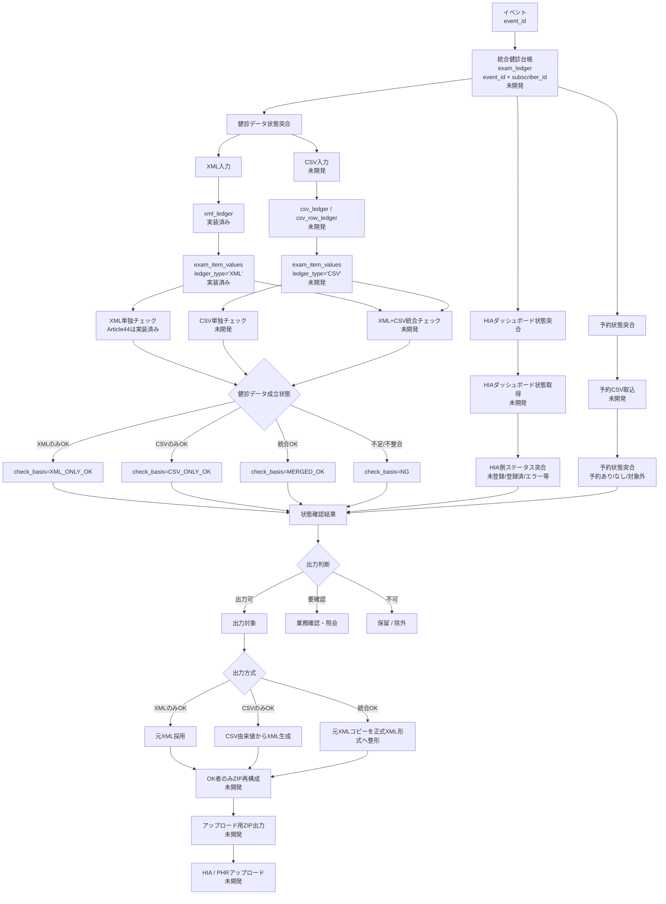

# health_exam_result v2 業務運用フロー

このドキュメントは、`health_exam_result v2` の業務運用フローを整理する。

`06_flow.md` はローカルシステム処理を扱う。本ドキュメントでは、イベント内の対象者を中心に、健診データ状態、HIAダッシュボード状態、予約状態を突合し、出力・確認・保留を判断する業務フローを扱う。

---

## 1. 目的

v2では、XMLを取り込んでArticle44チェックを行う基盤が整ってきている。

一方、実運用では以下を人単位で揃えて判断する必要がある。

- 健診データが成立しているか。
- XMLだけでOKか、CSVだけでOKか、XML+CSV統合でOKか。
- HIAダッシュボード上の状態と矛盾していないか。
- 予約情報と受領結果が矛盾していないか。
- アップロード用ZIPへ出力してよいか。
- 医療機関確認、再提出、未着確認へ回すべきか。

そのため、今後は `subscribers` とイベントを中心にした人単位の状態管理が必要になる。

---

## 2. 06_flow.md との責務分離

| ドキュメント | 対象 | 主な責務 |
| --- | --- | --- |
| `06_flow.md` | システム処理 | scan、XML取込、健診値保存、Article44チェック、DB保存 |
| `13_operation_flow.md` | 業務運用 | 健診データ状態突合、HIAダッシュボード突合、予約突合、出力判断、確認・再提出・未着管理 |

アップロード可否は、scan/import/check直後に単独で決めるものではない。健診データ状態、HIAダッシュボード状態、予約状態を突合した後に判断する。

---

## 3. 中心となる台帳の考え方

現行実装では、XML単位の `xml_ledger` が中心になっている。

将来的な業務運用では、以下のような一層上の台帳が必要になる。

```text
event_id
  ↓
exam_ledger
  event_id + subscriber_id + 健診回
  ↓
  xml_ledger
  csv_ledger / csv_row_ledger
```

`exam_ledger` はまだ未実装の候補名である。役割は、イベント内の対象者1人分の健診データ状態を束ねること。

想定する状態は以下。

| 状態 | 意味 | 実装状況 |
| --- | --- | --- |
| `exam_data_match_status` | XML/CSVを含む健診データ成立状態 | 未開発 |
| `dashboard_match_status` | HIAダッシュボード状態との突合結果 | 未開発 |
| `reservation_match_status` | 予約CSVとの突合結果 | 未開発 |
| `output_decision_status` | 出力可否の最終判断 | 未開発 |
| `output_mode` | 元XML採用、CSVから生成、統合XML生成など | 未開発 |
| `upload_status` | 実際のアップロード後状態 | 未開発 |

`upload_status` は状態突合の前提ではなく、出力・アップロード後に更新される後続状態とする。

---

## 4. 業務運用フロー全体



---

## 5. 健診データ状態突合

健診データ状態突合は、XMLとCSVを含む健診データそのものが成立しているかを見る。

現時点ではXML単独のArticle44 23項目チェックまで実装済み。

将来的には以下を判定する。

| 判定 | 意味 |
| --- | --- |
| `XML_ONLY_OK` | XMLだけで必要チェックを満たす |
| `CSV_ONLY_OK` | CSVだけで必要チェックを満たす |
| `MERGED_OK` | XMLとCSVを統合すると必要チェックを満たす |
| `NG` | XML/CSVを合わせても不足または不整合が残る |

CSVは `exam_item_values` へ合流させる。XMLとCSVで別テーブルに健診値を分けるのではなく、入力台帳を分け、値は共通の `exam_item_values` に保存する。

```text
xml_ledger
  ↓
exam_item_values ledger_type='XML'

csv_ledger / csv_row_ledger
  ↓
exam_item_values ledger_type='CSV'
```

CSVのみOK、または統合OKの場合は、HIAアップロードに必要なXMLを生成する。ただし、これは値を改変する処理ではない。受け取った値を正式なXML形式へ整形する処理として扱う。

---

## 6. HIAダッシュボード状態突合

HIAダッシュボード状態突合は、HIA側で見えている状態と、v2側の健診データ状態が矛盾していないかを見る。

例。

- HIA側では未登録だが、v2では出力対象。
- HIA側では登録済みだが、v2では未出力。
- HIA側でエラーだが、v2では再出力対象になっていない。

現時点では未開発。

---

## 7. 予約状態突合

予約状態突合は、予約CSVと健診データの受領状態を突合する。

例。

- 予約あり、結果あり。
- 予約あり、結果なし。
- 予約なし、結果あり。
- 対象外者の結果が届いている。

現時点では未開発。予約CSVの取込先、キー、対象者照合方法は別途設計する。

---

## 8. 出力判断

出力判断は、健診データ状態突合、HIAダッシュボード状態突合、予約状態突合の後に行う。

出力方式は以下を想定する。

| 出力方式 | 意味 |
| --- | --- |
| `USE_ORIGINAL_XML` | XMLのみでOKのため、元XMLを採用する |
| `GENERATE_FROM_CSV` | CSVのみでOKのため、CSV由来値からXMLを生成する |
| `GENERATE_MERGED_XML` | XML+CSV統合でOKのため、元XMLコピーを正式XML形式へ整形する |
| `NONE` | 出力しない |

OK者のみをZIPへ再構成してアップロード対象とする。NG、確認中、保留、対象外は出力しない。

---

## 9. 医療機関確認・再提出フロー

### 発生条件

- 健診データ状態突合で不足または不整合が残る。
- HIAダッシュボード状態とv2側状態が矛盾する。
- 予約状態と受領結果が矛盾する。
- 社内判断だけでは修正可否を判断できない。

### 流れ

```text
状態確認結果
  ↓
要確認
  ↓
医療機関へ確認
  ↓
回答受領
  ↓
回答内容により分岐
  ├─ 社内で整理可能 → 再処理
  ├─ 再提出必要 → 再提出待ち
  └─ 対象外/許容 → 状態確認結果へ反映
```

再提出されたファイルは別ファイルとして扱い、元ファイルを直接上書きしない。`file_receipts` では別レコードとして管理する。将来的には、元ファイルと再提出ファイルの親子関係・世代管理を検討する。

---

## 10. 結果未着管理

結果未着管理は、予約状態突合の結果として扱う。

```text
予約あり
  ↓
健診データなし
  ↓
未着者
  ↓
医療機関へ確認
```

現時点では未開発。`exam_ledger` のような人単位台帳を整備した後に本格対応する。

---

## 11. HIAアップロード後フロー

HIAアップロード後の状態は、出力判断後の後続状態として扱う。

```text
アップロード用ZIP出力
  ↓
HIA / PHRアップロード
  ↓
アップロード結果確認
  ├─ 成功 → 処理済み
  └─ エラー → HIAダッシュボード状態突合または業務確認へ戻す
```

現時点では未開発。アップロード実行後の自動結果反映も後続フェーズで検討する。

---

## 12. 受領台帳との関係

既存の受領台帳は業務運用上存在するが、v2の正とはしない。

v2の正は `health_exam_result` 側の台帳とし、受領台帳は業務向けの外部管理表として扱う。

将来的には、`file_receipts`、`xml_ledger`、`exam_ledger`、`exam_check_results` などのサマリーをもとに、受領台帳へ処理結果を反映する。

---

## 13. 現時点で実装済みの範囲

- ファイルscan。
- XML import。
- XML台帳。
- XML由来 `exam_item_values`。
- section情報保存。
- interpretationCode保存。
- Article44 23項目チェック。
- `exam_check_results` へのa44 46列保存。
- `xml_ledger.check_status / check_reason` 更新。

---

## 14. 現時点で未開発の範囲

- `exam_ledger`。
- CSV取込。
- `csv_ledger` または `csv_row_ledger`。
- CSV由来 `exam_item_values`。
- XML+CSV統合チェック。
- HIAダッシュボード状態取得。
- 予約CSV取込。
- 予約状態突合。
- 出力判断。
- OK者のみZIP再構成。
- アップロード用ZIP出力。
- HIA / PHRアップロード結果反映。
- 医療機関確認・再提出の専用DB管理。
- 未着管理。

---

## 15. 今後決めること

1. `exam_ledger` を作るか、別名の人単位台帳にするか。
2. `exam_ledger` のキーを `event_id + subscriber_id + 健診回` とするか。
3. CSV台帳を `csv_ledger` とするか、行単位の `csv_row_ledger` とするか。
4. CSV値を `exam_item_values` へ合流させる時の `ledger_type / ledger_id` の扱い。
5. XML単独、CSV単独、XML+CSV統合の優先順位。
6. 統合OK時に生成するXMLの証跡管理。
7. HIAダッシュボード状態の取得方法。
8. 予約CSVの取込・突合キー。
9. 出力判断ステータスの具体値。
10. アップロード後ステータスの保持先。
