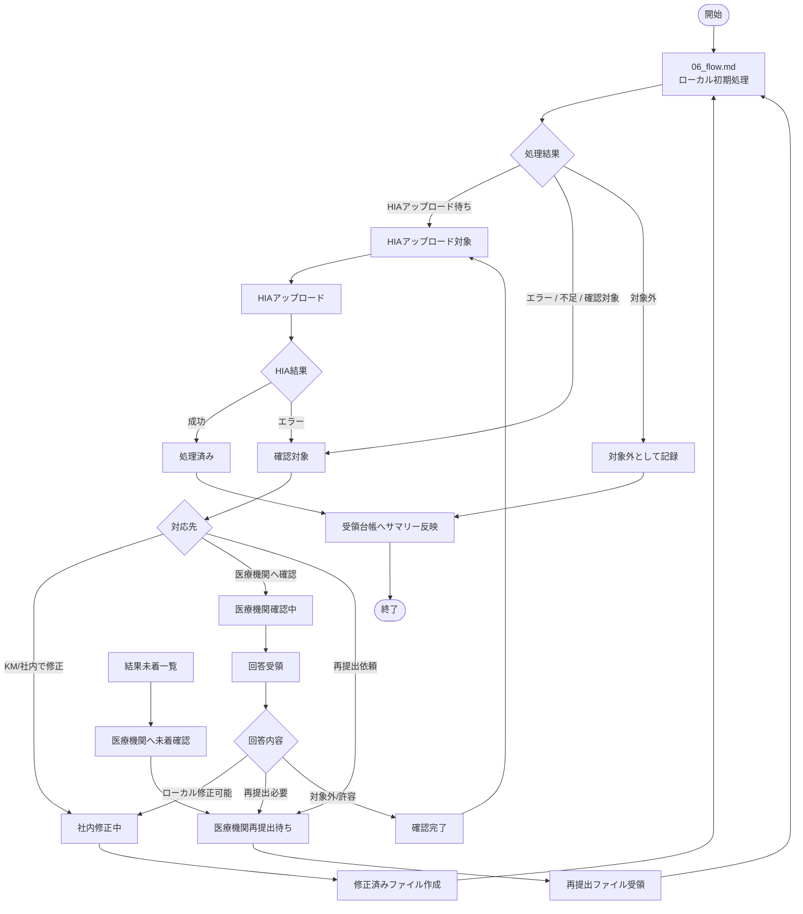

# health_exam_result v2 業務運用フロー

このドキュメントは、`health_exam_result v2` の初期処理フローから分離した業務運用フローを整理する。

`06_flow.md` はローカルシステム内の初期処理フローを扱う。本ドキュメントでは、医療機関回答待ち、再提出、結果未着管理、HIAアップロード後など、人・医療機関・HIAを含む業務状態を扱う。

---

## 1. 目的

初期実装では、まず `file_receipts`、`xml_ledger`、`item_values`、`exam_check_results` を中心にXML/受診者単位の品質保証基盤を作る。

ただし実運用では、以下のような業務状態が発生する。

- 医療機関へ確認が必要
- 医療機関から再提出を受領する
- 届くべき結果が未着
- HIAアップロード後に処理済みへ進める
- 受領台帳へサマリーを書き戻す

これらは初期処理フローとは責務が異なるため、本ドキュメントで別管理する。

---

## 2. 06_flow.md との責務分離

| ドキュメント | 対象 | 主な責務 |
| --- | --- | --- |
| `06_flow.md` | ローカルシステム処理 | ファイル登録、XML取込、加入者照合、item_values登録、チェック結果集約 |
| `13_operation_flow.md` | 業務運用 | 医療機関確認、再提出、未着管理、HIAアップロード後、受領台帳連携 |

---

## 3. 業務運用フロー全体



---

## 4. 医療機関回答待ちフロー

### 発生条件

- XMLまたは健診結果に不足がある。
- 値が空、nullFlavor、形式不備、明らかな異常値などがある。
- 社内判断だけでは修正可否を判断できない。

### 流れ

```text
確認対象
  ↓
医療機関へ確認
  ↓
回答受領
  ↓
回答内容により分岐
  ├─ 社内修正可能 → 修正後に再処理
  ├─ 再提出必要 → 再提出待ち
  └─ 対象外/許容 → HIAアップロード待ち または 処理済み
```

### 管理対象

- 対象ファイル
- 対象XML
- 対象者
- 確認項目
- 確認理由
- 回答内容
- 対応結果

---

## 5. 再提出フロー

### 発生条件

- 医療機関側でファイル修正が必要。
- 元ファイルではHIAアップロード不可。
- 再提出後に前回値との差分確認が必要。

### 流れ

```text
再提出依頼
  ↓
医療機関再提出待ち
  ↓
再提出ファイル受領
  ↓
02_健診結果（編集）へ配置
  ↓
06_flow.md の初期処理へ戻す
```

### 考え方

- 再提出されたファイルは別ファイルとして扱う。
- 元ファイルを直接上書きしない。
- `file_receipts` では別レコードとして管理する。
- 将来的には、元ファイルと再提出ファイルの親子関係・世代管理を検討する。

---

## 6. 結果未着管理フロー

### 発生条件

- 予約・受診予定情報では受診済みまたは受診予定だが、健診結果が届いていない。
- event単位で対象者一覧を持つようになった段階で本格対応する。

### 流れ

```text
対象者/予約情報
  ↓
受領済みXML・結果データと突合
  ↓
未着者抽出
  ↓
医療機関へ確認
  ↓
再提出または結果送付待ち
```

### v2初期での扱い

- v2初期では本格実装しない。
- `xml_ledger` と `subscribers.id` が揃えば、Excel / Power Query 等で暫定的に一覧化できる。
- 本格実装は `person_event` または対象者台帳を整備した後に検討する。

---

## 7. HIAアップロード後フロー

### 発生条件

- `xml_ledger` または `exam_check_results` の結果がHIAアップロード可能となった。

### 流れ

```text
HIAアップロード待ち
  ↓
HIAへアップロード
  ↓
HIA結果確認
  ├─ 成功 → 処理済み
  └─ エラー → 確認対象へ戻す
```

### v2初期での扱い

- 初期実装では、HIAアップロード待ち状態までを主対象とする。
- HIAアップロード実行後の自動結果反映は後続フェーズで検討する。

---

## 8. 受領台帳との関係

### 方針

既存の受領台帳は業務運用上存在するが、v2の中核台帳とは別物として扱う。

v2では、`file_receipts` や `xml_ledger` のサマリーをもとに、受領台帳のメモ欄等へ処理結果を反映できるようにする。

### 書き戻しイメージ

```text
file_receipts / xml_ledger / exam_check_results
  ↓
処理件数・エラー件数・HIAアップロード待ち件数を集計
  ↓
受領台帳のメモ欄等へサマリー反映
  ↓
受領台帳上は処理済み扱い
```

### 注意

- 受領台帳をv2の正としない。
- v2の正は `health_exam_result` 側の台帳とする。
- 受領台帳は業務向けの外部管理表として扱う。

---

## 9. 初期実装でやらないこと

- 医療機関回答待ちの専用DB管理
- 再提出ファイルの親子関係管理
- 再提出前後の値差分比較
- 結果未着管理の本格実装
- HIAアップロード後の自動結果反映
- 受領台帳への自動書き戻し

---

## 10. 今後決めること

1. 業務フローステータスの具体値。
2. 医療機関確認中・社内修正中・再提出待ちをどのテーブルで管理するか。
3. 再提出ファイルと元ファイルの親子関係・世代管理。
4. HIAアップロード後の成功/エラー結果をどこへ保持するか。
5. 結果未着管理を `person_event` で扱うか、別テーブルで扱うか。
6. 受領台帳へのサマリー反映を手動・CSV・自動更新のどれにするか。

---

## 11. 現時点の考え

v2初期実装では、業務運用フローをすべてDB化しない。

まずは `06_flow.md` のローカル初期処理を完成させ、ファイル・XML・健診値・チェック結果の品質保証基盤を作る。

医療機関回答待ち、再提出、未着管理、HIAアップロード後処理は、その基盤の上に後続フェーズで追加する。