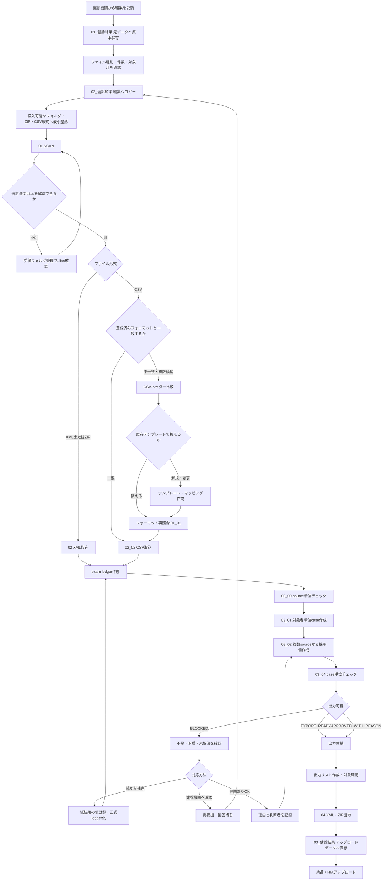

# 健診結果取込 現行業務フローと要員試算

## 1. 目的

この資料は、健診結果の受領からHIA向けXML出力までについて、次を同じ流れで確認できるようにする。

- 人が行う業務
- システムが行う処理
- 処理単位
- 所要時間の目安
- 増員判断に使う工数試算

処理時間は実行環境の実測値がまだ集計できていないため、初版では仮置きレンジとする。今後 `etl_runs.started_at / finished_at` の実績から置き換える。

## 2. 業務とシステムの全体フロー



## 3. 工程別の処理単位と時間目安

### 3.1 人が行う業務

| 工程 | 主な処理単位 | 標準的な時間の仮置き | 時間が増える条件 |
| --- | --- | ---: | --- |
| 受領・原本保存 | 健診機関 × 受領回 | 3〜10分 | ファイル分割、暗号ZIP、命名不備 |
| `01`から`02`へのコピー・最小整形 | 健診機関 × 受領回 | 10分 | 1施設・1受領回・1ファイル（ZIPまたはCSV）を前提。フォルダ再構成、複数ファイル、紙との突合は別途加算 |
| 受領内容・フォーマット確認 | 健診機関 × ファイル形式 | 2〜5分 | 初回施設、CSV変更、ヘッダー不一致 |
| 既存CSVとの差分確認 | CSVテンプレート × 変更回 | 10〜30分 | 列追加、列削除、列順変更、記号付きヘッダー |
| 新規CSVマッピング作成 | CSVテンプレート | 30分/件、年1件 | 項目数、結合、条件分岐、コード値確認が多い場合は別途加算 |
| source/caseエラー理由確認 | エラー発生健診機関 | 15分/健診機関 | 複数原因、加入者不一致、健診機関への照会は別途加算 |
| エラー結果修正 | 修正対象者 | 5分/人 | 複数source、複数項目、紙との照合が必要な場合は別途加算 |
| 0から健診データ作成 | 対象者 | 10分/人 | 元になるXML・CSVがなく、必要項目を新規作成する場合 |
| 紙から補正データ作成 | 対象者 | 5分/人 | 既存XML・CSVの不足項目を紙結果から補完する場合 |
| 理由ありOK判断 | NG項目または対象者 | 2〜5分/人 | 医療機関への照会、判断根拠の確認 |
| 出力リスト最終確認 | 出力バッチ | 5〜15分 | 再出力、複数健診機関、複数受診月 |
| HIAアップロード・処理記帳 | アップロード対象健診機関 | 10分/健診機関 | 外部画面操作、結果確認、処理証跡の記帳を含む |

### 3.2 システムが行う処理

| 番号 | 処理 | 主な処理単位 | 実行範囲 | 機械処理時間の初期仮置き |
| --- | --- | --- | --- | ---: |
| `01` | ファイルSCAN、alias解決、CSVフォーマット照合 | イベント内の健診機関フォルダ・ファイル | イベント単位。内部では健診機関・ファイル単位 | 1〜5分/イベント |
| `01_01` | CSVフォーマット再照合 | CSVファイル | イベント単位、対象状態のファイル単位 | 数秒〜1分/ファイル |
| `02` | ZIP展開、XML取込、加入者照合、値登録 | file receipt / XML / 対象者 | イベントまたはscan run単位 | 5〜30分/1,000人 |
| `02_02` | CSV行取込、ルール適用、値登録 | CSV行 = 対象者 | イベントまたはfile receipt単位 | 2〜15分/1,000人 |
| `03_00` | source単位チェック | ledger | イベント単位 | 1〜10分/1,000 ledger |
| `03_01` | 同一対象者のsourceをcaseへ束ねる | 加入者・受診単位 | イベント、case、subscriber単位 | 1〜10分/1,000人 |
| `03_02` | 採用値作成 | case × 健診項目 | イベントまたはcase単位 | 2〜15分/1,000人 |
| `03_04` | case単位の法定・特定健診チェック | case | イベントまたはcase単位 | 1〜10分/1,000人 |
| `03_05` | 出力リスト作成 | case | 条件指定、健診機関、受診月、対象者単位 | 数秒〜数分/リスト |
| `04` | XML生成、厚労省形式ZIP作成 | case、健診機関、受診月 | 出力リストまたは各種selector単位 | 1〜10分/1,000人 |

機械処理時間はファイルサイズ、健診項目数、DB性能、ネットワーク共有フォルダ速度で変わる。増員試算では、人が待機している時間と他作業ができる時間を分けて扱う。

## 4. 処理単位の整理

| 単位 | 該当する主な工程 | 要員試算で使う意味 |
| --- | --- | --- |
| イベント | `01`, `02`, `03_00`〜`03_04`の一括実行 | 1回の運用バッチ |
| 健診機関 | 受領、`01`から`02`への移動、フォーマット確認、出力分割 | 受領担当者の基本作業量 |
| ファイル | scan、形式判定、XML/CSV取込 | ファイル分割が多い施設の負荷 |
| CSVテンプレート | ヘッダー比較、マッピング作成・変更 | 初回導入・仕様変更の負荷 |
| ledger | source単位チェック | XML、CSV、手入力が増えるほど増加 |
| case / 対象者 | 採用値作成、caseチェック、理由ありOK | 確認担当者の基本作業量 |
| 出力バッチ | 出力リスト、ZIP出力、納品 | 納品回数に比例する負荷 |

システムは健診機関単位だけで完結せず、前半は健診機関・ファイル単位、後半は対象者・case単位へ処理軸が変わる。

## 5. 人員試算の計算式

月間業務時間は、まず次の式で試算する。

```text
月間工数（分） =
  受領回数 × 原本保存時間
  + 受領回数 × 01→02コピー・最小整形時間
  + フォーマット変更数 × 差分確認時間
  + 新規テンプレート数 × マッピング作成時間
  + エラー発生健診機関数 × エラー理由確認時間
  + 修正対象者数 × 結果修正時間
  + 0からデータ作成する対象者数 × 10分
  + 紙から補正する対象者数 × 5分
  + 理由ありOK者数 × 判断記録時間
  + 出力バッチ数 × 最終確認時間
  + HIAアップロード対象健診機関数 × 10分
```

初期中央値を置く場合は次を使う。

| 変数 | 初期中央値 |
| --- | ---: |
| 受領・原本保存 | 5分/健診機関・受領回 |
| `01→02`コピー・最小整形 | 10分/健診機関・受領回（1 ZIPまたは1 CSV） |
| 既存CSV差分確認 | 20分/変更テンプレート |
| 新規CSVマッピング | 30分/テンプレート、年1件（月平均2.5分） |
| エラー理由確認 | 15分/エラー発生健診機関 |
| エラー結果修正 | 5分/対象者 |
| 0から健診データ作成 | 10分/対象者 |
| 紙から補正データ作成 | 5分/対象者 |
| 理由ありOK | 3分/対象者 |
| 出力リスト最終確認 | 10分/バッチ |
| HIAアップロード・処理記帳 | 10分/健診機関 |

## 6. 試算例

次の月間条件を仮定する。

- 213健診機関から各1回受領
- CSV変更テンプレート2件
- 新規CSVテンプレート1件/年
- エラー発生健診機関5施設
- 30,000人中、結果修正15% = 4,500人
- 0から健診データ作成1% = 300人
- 紙から補正データ作成5% = 1,500人
- 理由ありOK 300人
- 出力4バッチ
- HIAアップロード対象213健診機関

```text
213 × 5分 = 1,065分（原本保存）
213 × 10分 = 2,130分（01→02コピー・最小整形）
2 × 20分 = 40分
1 × 30分 ÷ 12か月 = 2.5分（月平均。作成月は30分）
5 × 15分 = 75分（エラー理由確認）
4,500 × 5分 = 22,500分（結果修正）
300 × 10分 = 3,000分（0から健診データ作成）
1,500 × 5分 = 7,500分（紙から補正データ作成）
300 × 3分 = 900分
4 × 10分 = 40分（出力リスト最終確認）
213 × 10分 = 2,130分（HIAアップロード・処理記帳）

合計 39,382.5分 = 約656.38時間/月
```

この例では定常処理だけで月約656.38時間となる。月160時間を1人月とした単純換算では約4.10人月になる。特に原本保存、`01→02`コピー、HIAアップロード・処理記帳の3工程だけで5,325分、約88.75時間を占める。さらに対象者数に比例する結果修正と手入力・補正で33,000分、550時間を占める。新規CSVマッピングは年1件30分のため、人員数への影響は小さい。受領・確認・納品が特定日に集中するため、人数判断では平均工数だけでなくピーク日の同時作業量も見る。

## 7. 1人増員した場合の追加処理可能施設数・人数

### 7.1 対象者1人あたりの変動工数

現在の仮定から、対象者数に比例する作業時間を1人あたりへ直す。

| 作業 | 発生率 | 発生時の時間 | 全対象者1人あたり |
| --- | ---: | ---: | ---: |
| 結果修正 | 15% | 5分 | 0.75分 |
| 0から健診データ作成 | 1% | 10分 | 0.10分 |
| 紙から補正データ作成 | 5% | 5分 | 0.25分 |
| 理由ありOK | 1% | 3分 | 0.03分 |
| 合計 | - | - | **1.13分/対象者** |

### 7.2 参考: 既存213施設の中で対象者だけが増える場合

施設数が増えなければ、原本保存、`01→02`コピー、HIAアップロードの施設単位工数は増えない。

```text
1人月160時間 = 9,600分
9,600分 ÷ 1.13分/人 = 約8,496人
```

会議、問い合わせ、休暇、突発対応を考慮して、実作業へ使える時間を80%の128時間とした場合は次になる。

```text
128時間 = 7,680分
7,680分 ÷ 1.13分/人 = 約6,796人
```

したがって、既存施設内で対象者だけが増える場合、1人増員による追加処理可能人数は、理論値約8,500人、80%稼働の現実的な目安で約6,800人とする。

### 7.3 基本試算: 施設数も現在と同じ比率で増える場合

現在は30,000人 ÷ 213施設で、1施設あたり平均約140.85人である。

施設単位で増える作業は次の合計25分とする。

- 原本保存: 5分/施設
- `01→02`コピー・最小整形: 10分/施設
- HIAアップロード・処理記帳: 10分/施設

この施設単位工数を対象者1人あたりへ換算する。

```text
25分 ÷ 140.85人 = 約0.18分/対象者
対象者単位1.13分 + 施設増加分0.18分 = 約1.31分/対象者
```

1施設あたりの月間工数は次になる。

```text
施設単位作業 25分
+ 140.85人 × 1.13分 = 約184.16分/施設
```

| 稼働条件 | 増員1人の時間 | 追加処理可能施設数 | 追加処理可能人数 |
| --- | ---: | ---: | ---: |
| 理論上100% | 160時間/月 | 約52施設 | 約7,340人 |
| 実作業80% | 128時間/月 | 約42施設 | 約5,870人 |

増員説明では施設数も比例して増える前提を基本とし、1人増員あたり約42施設・約5,900人を、現実的な追加処理量の初期目安とする。

現在の30,000人へ加算した場合の目安は次のとおり。

| 増加条件 | 追加可能人数 | 増員後の総処理人数 |
| --- | ---: | ---: |
| 既存213施設内で人数だけ増加 | 約6,800人 | 約36,800人 |
| 約42施設も現在比率で増加 | 約5,900人 | 約35,900人・約255施設 |

## 8. 増員判断で分けて計測する項目

次の時間は性質が異なるため、同じ「処理時間」にまとめない。

1. システムが動いている機械時間
2. 担当者が画面を見て待機する時間
3. 別作業が可能な待ち時間
4. 健診機関への問い合わせ・回答待ち
5. 実際に入力・判断している作業時間

増員効果が直接出るのは主に、受領整形、フォーマット確認、エラー確認、手入力、理由ありOK、出力確認である。機械処理時間が長い場合は、増員より先にcase単位再実行、健診機関単位実行、並列化、DB索引を検討する。

## 9. 今後の実測

運用開始後は、少なくとも次を月次で記録する。

- 健診機関別の受領回数とファイル数
- `01`から`04`までのrun別所要時間
- 取込対象者数、ledger数、case数
- `WAITING_CONFIRM`, `BLOCKED`, `APPROVED_WITH_REASON`件数
- CSVテンプレートの新規・変更件数
- 手入力人数と入力時間
- 健診機関への問い合わせ件数と解決日数
- 出力バッチ数と再出力件数

3回以上の実績が集まった工程から、仮置き時間を中央値と90パーセンタイルへ置き換える。

## 10. 管理画面での試算

業務管理用ユーティリティとして `/admin/workload-estimate` を設ける。HOMEの「ユーティリティ」から開き、作業管理者の `business_settings.manage` またはシステム管理者の `users.manage` 権限を持つ利用者が参照できる。

画面では次の2種類を並べて表示する。

- 想定試算: 対象人数、施設数、発生割合、1件あたり時間を使った計画値
- DB実数ベース: 選択イベントのcase、施設、法定NG、理由ありOK、正式反映済み手入力の実数を同じ作業時間へ掛けた換算値

DB実数ベースの工数は途中件数をそのまま使わず、現在のcase数を分母として目標対象者数まで外挿する。初期目標は30,000人とし、例えば3,000 case時点の法定NGが450件なら、発生率15%として30,000人時点の4,500件へ換算する。施設単位の作業は、現在までに登場した施設数から目標213施設へ比例換算する。

画面には1人増員の目安も表示する。対象者・施設数に比例する月間工数を目標対象者数で割って1人あたり増分工数を求め、担当者1人の月間実働可能時間をその値で割る。想定条件とDB実績率のそれぞれについて、何人の追加対象者で担当者1人分の工数になるか、同時に何施設程度増える前提かを表示する。

実数の読み方には、法定NG件数だけでなく `法定NG件数 / case総数` のNG率と、`case総数 / 施設数` の1施設平均case数を表示する。施設数が0の場合は平均を算出しない。

入力値の変更は画面内だけに保持し、DBへ保存しない。DB実数の入力欄も一時的に補正できるが、初期値へ戻すと画面表示時のDB値へ戻る。

DB実数ベースは運用途中の累積値であり、未受領・未処理の件数を含まない。将来の必要人数は想定試算、現在の発生傾向はDB実数ベースで判断する。

初期集計の定義は次のとおり。

| 表示項目 | DB上の定義 |
| --- | --- |
| case総数 | 選択イベントの `exam_export_cases` 件数 |
| 施設数 | caseに存在する `exam_facility_id` の異なり数 |
| 法定NG | `check_status = NG` のcase件数 |
| NG施設 | 法定NG caseに存在する健診機関の異なり数 |
| 理由ありOK | `export_readiness_status = APPROVED_WITH_REASON` のcase件数 |
| 紙のみ | `entry_purpose = PAPER_ONLY` かつ正式ledger反映済みの手入力件数 |
| 補正手入力 | `entry_purpose = SUPPLEMENT` かつ正式ledger反映済みの手入力件数 |

この画面の追加にDB migrationは不要とする。
